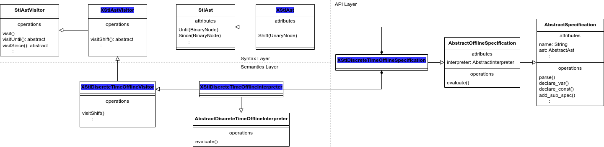

# Syntax Extension

<!-- markdown-toc start - Don't edit this section. Run M-x markdown-toc-generate-toc again -->
**Table of Contents**

- [Syntax Extension](#syntax-extension)
  - [Overview](#overview)
  - [Extend Syntax](#extend-syntax)
    - [ANTLR grammar](#antlr-grammar)
    - [RTAMT AST node](#rtamt-ast-node)
    - [RTAMT AST visitor](#rtamt-ast-visitor)
  - [Extend semantics](#extend-semantics)
  - [Merge syntax and semantics into spec](#merge-syntax-and-semantics-into-spec)
  - [Test](#test)

<!-- markdown-toc end -->

## Overview

This document gives an example of how RTAMT library can be extended in a way that maximizes reuse of existing code.

This is code architecture of RTAMT.

To extend temporal logic XSTL, we need to implement both Syntax and Semantics layer. Finally we may merge the syntax and semantics into a spec in specification layer. In syntax extension, we may need three steps.

1. Define syntax
   1. based on ANTLR.
   In `rtamt/rtamt/antlr/`,
   We may extend `parser` (parser.g4) and `lexer` (lexer.g4). ANTLR can auto generate ParserVisitor.
   1. Extend RTAMT AST node and parser.
   In `rtamt/rtamt/syntax/node`,
   Since RTAMT utilizing its AST, we need to extend `AbstractAst`. This time we extend `StlAst` since XSTL is very closed to STL.
   1. Extend RTAMT AST visitor.
   In `rtamt/rtamt/syntax/`,
   Regarding above, we may extend `AbstractAstVisitor` as well to enable any semantics layer visitors can visit. That is very crucial class in RTAMT. We extend `StlAstVisitor` since XSTL is very closed to STL.
1. Extend semantics
In `rtamt/rtamt/semantics/`,
Based on the new visitor, we may extend `AbstractDiscreteTimeOfflineInterpreter` in offline fashion. We extend `StlDiscreteTimeOfflineInterpreter` since XSTL is very closed to STL.
1. Merge syntax and semantics into spec.
That connects the syntax and semantics into spec class with a few lines of codes based on `AbstractOfflineSpecification`.

In this part of the tutorial, we want to extend `RTAMT` with a `Shift` operator as XSTL, where `shift(phi, v)` is equivalent to `once[v,v] phi`, providing a more efficient implementation of this special case.

Here is class diagram in specific XSTL case. Highlighted classes are what designer needs to implement.


## Extend Syntax

### ANTLR grammar

In the first step, we need to extend the `STL` grammar with the new syntax and the new rules. We will use the name `XSTL` to denote the extended `STL` grammar.

We need to extend the STL lexer and the parser. We consequently create the files `XStlLexer.g4` and `XStlParser.g4` files in `rtamt/antlr/grammar/tl`.
The new lexer inherits the majority of the tokens from `StlLexer.g4`, and extends it with the `shift` keyword.

```ANTLR
lexer grammar XStlLexer ;

import StlLexer;

ShiftOperator
	: 'shift';
```

Similarly, `XStlParser.g4` inherits the majority of rules from `StlParser.g4`. It only needs to redefine the `expresssion` and add the `shift` rule to it.

```ANTLR
parser grammar XStlParser ;
import StlParser;

options {
    tokenVocab = XStlLexer ;
}

expression
    :
    real_expression                                             #ExprReal
    | expression comparisonOp expression                        #ExprPredicate
    | LPAREN expression RPAREN                                  #ExprParen
    | NotOperator expression                                    #ExprNot
    | expression OrOperator expression                          #ExprOr
    | expression AndOperator expression                         #ExprAnd
    | expression ImpliesOperator expression                     #ExprImplies
    | expression IffOperator expression                         #ExprIff
    | expression XorOperator expression                         #ExprXor
    | AlwaysOperator ( interval )? expression                   #ExprAlways
    | EventuallyOperator ( interval )? expression               #ExprEv
    | ShiftOperator LPAREN expression COMMA intervalTime RPAREN #ExprShift
    | expression UntilOperator ( interval )? expression         #ExprUntil
    | expression UnlessOperator ( interval )? expression        #ExprUnless
    | HistoricallyOperator ( interval )? expression             #ExprHist
    | OnceOperator ( interval )? expression                     #ExpreOnce
    | expression SinceOperator ( interval )? expression         #ExprSince
    | RiseOperator LPAREN expression RPAREN                     #ExprRise
    | FallOperator LPAREN expression RPAREN                     #ExprFall
    | PreviousOperator expression                               #ExprPrevious
    | NextOperator expression                                   #ExprNext
    ;
```

### RTAMT AST node

In the subsequent step, we need to create an internal representation for the shift node. We create a `Shift` node class in `rtamt/syntax/node/xstl/shift.py`.

```python
from rtamt.syntax.node.unary_node import UnaryNode


class Shift(UnaryNode):
    def __init__(self, child, val, val_unit):
        UnaryNode.__init__(self, child)
        self.val = val
        self.val_unit = val_unit

        self.in_vars = child.in_vars
        self.out_vars = child.out_vars

        self.name = 'shift(' + child.name + ',' + str(val) + str(val_unit) + ')'
```

Similarly to timed temporal operator nodes, `Shift` takes as input the value by which the operand must be shifted in terms of two strings - `val` representation of a decimal number and `val_unit` unit of the value.

The actual visitor for XSTL formulas (that extends the default visitor created by ANTLR4) inherits most visit rules from its STL counterpart. The only visit rule that needs to be implemented is for the shift rule. This is done in `rtamt/syntax/ast/parser/xstl/parser_visitor.py`

```python
from rtamt.antlr.parser.xstl.XStlParserVisitor import XStlParserVisitor
from rtamt.syntax.ast.parser.stl.parser_visitor import StlAstParserVisitor
from rtamt.syntax.node.xstl.shift import Shift


class XStlAstParserVisitor(StlAstParserVisitor, XStlParserVisitor):

    def __init__(self):
        StlAstParserVisitor.__init__(self)
        XStlParserVisitor.__init__(self)

    def visitExprShift(self, ctx):
        child = self.visit(ctx.expression())
        val, val_unit = self.visit(ctx.intervalTime())
        node = Shift(child, val, val_unit)
        return node
```

Now, we are ready to parse XSTL formulas and create an internal representation of the AST. We may create an `XStlAst` object that merge `XStlLexer` and `XStlParser` from ANTLR, and `XStlAstParserVisitor` that enables to parse RTAMT AST in specific XSTL case as well as `StlAst`.
This is done in `rtamt/syntax/ast/parser/xstl/specification_parser.py`

```python
from rtamt.syntax.ast.parser.abstract_ast_parser import ast_factory
from rtamt.syntax.ast.parser.xstl.parser_visitor import XStlAstParserVisitor
from rtamt.antlr.parser.xstl.XStlLexer import XStlLexer
from rtamt.antlr.parser.xstl.XStlParser import XStlParser
from rtamt.antlr.parser.xstl.error.parser_error_listener import XSTLParserErrorListener


def XStlAst():
    antrlLexerType = globals()['XStlLexer']
    antrlParserType = globals()['XStlParser']
    parserErrorListenerType = globals()['XSTLParserErrorListener']   #optional
    xstlAst = ast_factory(XStlAstParserVisitor)(antrlLexerType, antrlParserType, parserErrorListenerType)
    return xstlAst
```

### RTAMT AST visitor

Above section enables to generate XSTL AST based on RTAMT AST. Now we may construct its visitor. We may extend `StlAstVisitor` since the XSTL is very closed to StlAstVisitor. However, we may also implement it from scratch based on `AbstractAstVisitor`.
This is done in `rtamt/syntax/ast/visitor/xstl/ast_visitor.py`

```python
from rtamt.exception.stl.exception import STLVisitorException
from rtamt.syntax.ast.visitor.stl.ast_visitor import StlAstVisitor
from rtamt.syntax.node.xstl.shift import Shift


class XStlAstVisitor(StlAstVisitor):

    def visit(self, node, *args, **kwargs):
        if isinstance(node, Shift):
            result = self.visitShift(node, *args, **kwargs)
        else:
            result = super(XStlAstVisitor, self).visit(node, *args, **kwargs)

        return result

    def visitShift(self, node, *args, **kwargs):
        return self.visitChildren(node, *args, **kwargs)

    def raise_exception(self, text):
        raise STLVisitorException(text)
```

This `XStlAstVisitor` becomes a crucial class for semantics layer below.

## Extend semantics

Now that we have our internal representation of XSTL, we need to implement the monitoring algorithm to treat the shift operator. We show how to do it for discrete-time offline monitoring algorithm. The other options (dense-time, online) are done similarly.

We create a custom visitor that implements the discrete-time offline monitoring algorithm. This is done in `rtamt/semantics/xstl/discrete_time/offline/ast_visitor.py`.
The new visitor inherits all monitoring functionality from
`StlDiscreteTimeOfflineAstVisitor`, and only needs to implement how to monitor the shift operation. Note that this is the place (`time_unit_transforme`) where the real-time shift (given in the form of two strings representing the value and the unit of the shift) is translated to an integer, representing to how many (logical) steps the shift corresponds, according to the sampling rate of the monitor.

```python
from rtamt.semantics.stl.discrete_time.offline.ast_visitor import StlDiscreteTimeOfflineAstVisitor
from rtamt.syntax.ast.visitor.xstl.ast_visitor import XStlAstVisitor


class XStlDiscreteTimeOfflineAstVisitor(StlDiscreteTimeOfflineAstVisitor, XStlAstVisitor):

    def visitShift(self, node, *args, **kwargs):
        sample = self.visit(node.children[0], *args, **kwargs)
        val = self.time_unit_transformer(node.val, node.val_unit)

        head = [-float("inf") for i in range(val)]
        tail = [sample[i] for i in range(0, len(sample)-val)]
        result = head + tail
        return result
```

Finally, we associate the visitor to the XSTL discrete-time offline interpreter in `rtamt/semantics/xstl/discrete_time/online/interpreter.py`

```python
from rtamt.semantics.abstract_discrete_time_offline_interpreter import discrete_time_offline_interpreter_factory
from rtamt.semantics.xstl.discrete_time.offline.ast_visitor import XStlDiscreteTimeOfflineAstVisitor


def XStlDiscreteTimeOfflineInterpreter():
    xstlDiscreteTimeOfflineInterpreter = discrete_time_offline_interpreter_factory(XStlDiscreteTimeOfflineAstVisitor)()
    return xstlDiscreteTimeOfflineInterpreter
```

## Merge syntax and semantics into spec

Finally, we need to provide an spec for the user to access the extended monitoring functionality. Simply the class marge syntax `XStlAst` and semantics `XStlDiscreteTimeOfflineInterpreter`. This is done in `rtamt/spec/xstl/specification.py`, where we define `XStlDiscreteTimeOfflineSpecification`.

```python
from rtamt.pastifier.xstl.pastifier import XStlPastifier
from rtamt.semantics.xstl.discrete_time.offline.interpreter import XStlDiscreteTimeOfflineInterpreter
from rtamt.spec.abstract_specification import AbstractOnlineSpecification, AbstractOfflineSpecification
from rtamt.syntax.ast.parser.xstl.specification_parser import XStlAst


def XStlDiscreteTimeOfflineSpecification():
    spec = AbstractOfflineSpecification(XStlAst(), XStlDiscreteTimeOfflineInterpreter())
    return spec
```

In the last step, we add `XSTLDiscreteTimeOfflineSpecification` to `rtamt/__init__.py`,

```python
from rtamt.spec.xstl.discrete_time.specification import XStlDiscreteTimeOfflineSpecification
```

so that the user can instantiate the monitor using `rtamt.XSTLDiscreteTimeOnlineSpecification` syntax.

## Test

A unit test showing how to instantiate the new monitor and checking
the correctness of the implementation is available in `tests/python/api/test_xstl.py`.

```python
import unittest
import rtamt


class XStlTest(unittest.TestCase):

    def __init__(self, *args, **kwargs):
        super(XStlTest, self).__init__(*args, **kwargs)

    def test_shift_offline(self):
        spec = rtamt.XStlDiscreteTimeOfflineSpecification()
        spec.declare_var('req', 'float')
        spec.declare_var('out', 'float')
        spec.spec = 'out = shift(req, 2)'

        spec.parse()

        dataset = {
            'time': [0, 1, 2, 3, 4],
            'req': [100, -1, -2, 5, -1]
        }

        out = spec.evaluate(dataset)
        expected = [[0, -float("inf")], [1, -float("inf")], [2, 100], [3, -1], [4, -2]]
        self.assertEqual(out, expected)
```
