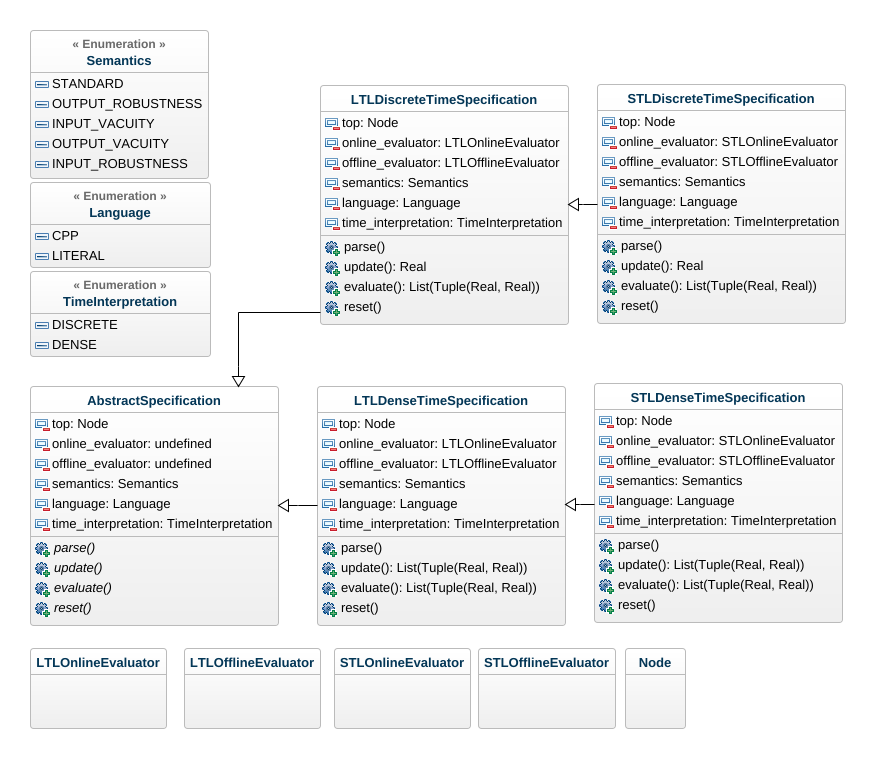
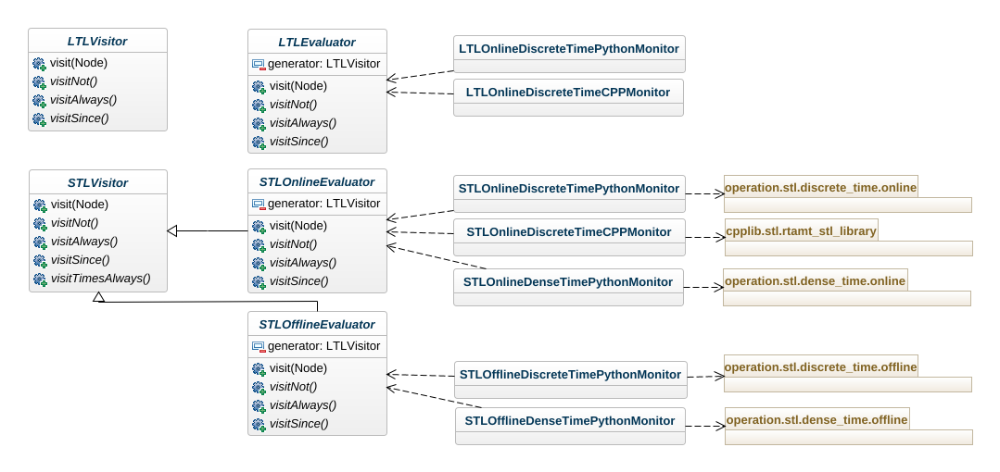
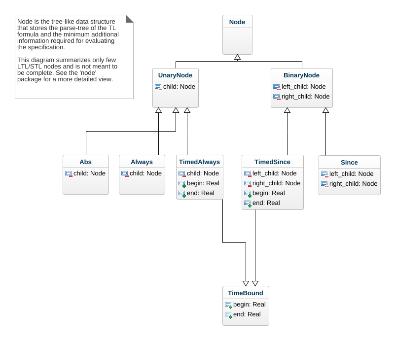

# Guideline for Extending RTAMT

This document explains the architecture of the library and provides guidelines 
for extending the library with (1) new operators, (2) existing syntax, 
but new semantics, and (3) alternative implementation of the existing algorithms.

## Overview of RTAMT architecture

### Top-level Architecture [rtamt/spec](../rtamt/spec)

The [AbstractSpecification](../rtamt/spec/abstract_specification.py) class as the main container class 
that also acts as the API between the user and the library. 
Concrete specifications are derived from this abstract class. Figure below 
depicts the most important attributes and methods of the class. 
The main attributes are:
- `top` – a pointer to a `Node` structure that encodes the parse-tree of the specification
- `offline_evaluator` – a pointer to an evaluator object that implements 
the offline evaluation (monitoring) algorithm
- `online_evaluator` - a pointer to an evaluator object that implements the 
online evaluation (monitoring) algorithm
- `semantics` – can be standard, output robustness, input vacuity, output vacuity 
and input robustness
- `time_interpretation` – can be discrete-time or dense-time
- `language` – implementation language of the monitoring algorithm, 
can be CPP or PYTHON

The main methods are:
- `parse()` – generates the parse tree of the specification from 
its textual description
- `update()` – does one monitoring step (evaluation) in the online monitor
- `evaluate()` – does the offline evaluation over the entire trace 
in the offline monitor
- `reset()` – resets the monitoring state of the monitor

The `AbstractSpecification` class does not implement these methods, but any 
derived class is expected to implement them (or throw a 
`NotImplemented` exception if a method is not meant to be implemented).

[LTLDiscreteTimeSpecification](../rtamt/spec/ltl/discrete_time/specification.py) is a class that is derived from 
`AbstractSpecification` and that is contains the implementation of 
discrete-time monitors for LTL. It provides a concrete implementation of 
`parse()`, `update()`, `evaluate()` and `reset()` methods. 

[STLDiscreteTimeSpecification](../rtamt/spec/stl/discrete_time/specification_parser.py) extends `LTLDiscreteTimeSpecification` 
with additional STL (timed) operators. 



### grammar [rtamt/grammar](../rtamt/grammar)

This contains lexser and paser setting based on [Antrl](https://www.antlr.org/).  

[rtamt/grammar/tl](../rtamt/grammar/tl)  
expects to contain typical temporal logics.
So, we implimented [Linier Temporal Logic](https://en.wikipedia.org/wiki/Linear_temporal_logic) (LTL) in  
[LtlLexer.g4](../rtamt/grammar/tl/LtlLexer.g4)  
[LtlParser.g4](../rtamt/grammar/tl/LtlParser.g4)  
and Signal Temporal Logic (STL) in  
[StlLexer.g4](../rtamt/grammar/tl/StlLexer.g4)  
[StlParser.g4](../rtamt/grammar/tl/StlParser.g4)  
while importing LTL with

```g4
parser grammar StlParser;
import LtlParser;
```

### parser [rtamt/parser](../rtamt/paser)

This contains auto-generated parsers from Antrl based on the above grammer.

### Evaluator [rtamt/evaluator](../rtamt/evaluator)

The parsed formulas are connected to the evaluator.
This seprates evaluation method, like online or offline, then went to node.


### Node [rtamt/node](../rtamt/node)

Finally, each fromulas reasch the nodes which are implimented spesific semantics.


### cpplib [rtamt/cpplib](../rtamt/cpplib)

cpp version of the nodes.

### Operation [rtamt/operation](../rtamt/operation)

TOM Comment: We need to explain here. The most of sematincs seems to be implimented in here in python case...

## Examples of Extending RTAMT

### Extending STL with a new operator

In this scenario, we extend STL with the past-time Backto operator. 
We first need a new grammar that defines the Backto operator. Hence, 
we create two new files - `StlExtendedLexer.g4` and `StlExtendedParser.g4` 
in [rtamt/grammar/tl](../rtamt/grammar/tl). 

`StlExtendedLexer.g4` has the same content as `StlLexer.g4`, except for an 
additional token.

```antlrv4
BacktoOperator
    : 'backto' | 'B' ;
```

`StlExtendedLexer.g4` imports `StlParser` and uses `StlExtendedLexer` as its 
lexer.

```antlrv4
parser grammar StlExtendedParser ;
import StlParser;

options {
    tokenVocab = StlExtendedLexer ;
}
```

It inherits all the rules from `StlParser`, except the `expression` rule that 
it overrides, by adding an additional sub-rule for the Backto operator:

```antlrv4
expression
    :
    // ...
    | expression BacktoOperator ( interval )? expression         #ExprBackto
    // ...
    ;
```

In the next step, we need to compile the new grammar with `antlr4`, using the 
following commands. 

We will generate the parser in a new Python package [rtamt/parser/xstl](../rtamt/parser/xstl) 
that we manually create (we should not forget adding the (empty) file `__init__.py`). 
In addition, we create another Python package [rtamt/parser/xstl/error](../rtamt/parser/xstl/error) 
for handling parsing errors and add the `parser_error_lister.py` file with the
`STLExtendedParserErrorListener` class that has the same content as 
`STLParserErrorListener` from [rtamt/parser/stl/error](../rtamt/parser/stl/error).

```bash
antlr4 StlExtendedLexer.g4 -Dlanguage=Python3 -no-listener -visitor -o ../../parser/xstl/
antlr4 StlExtendedParser.g4 -Dlanguage=Python3 -no-listener -visitor -o ../../parser/xstl/
```

The package [rtamt/parser/xstl](../rtamt/parser/xstl) contains 5 new files:

```text
StlExtendedLexer.py
StlExtendedLexer.tokens
StlExtendedParser.py
StlExtendedParser.tokens
StlExtendedParserVisitor.py
```

In the next step, we need to create a Visitor that inherits from the 
(automatically generated) class `StlExtendedParserVisitor` and create a 
parse-tree of the specification. Before we are able to do that, we 
need to create a `Node` for the Backto operator in [rtamt/node](../rtamt/node). 
We create a new Python package [rtamt/node/xstl](../rtamt/node/xstl) and add the 
files `backto.py` and `timed_backto.py`, which define the `BacktoNode` and 
`TimedBacktoNode` classes, respectively.

In this tutorial, we will only implement discrete-time online monitors for 
Extended STL implemented in Python.

We are now ready to create a container for Extended STL specifications 
and store them as a `Node` parse tree. In [rtamt/spec](../rtamt/spec), we 
create a new Python package `xstl`. In [rtamt/spec/xstl](../rtamt/spec/xstl), we create another Python package 
`discrete_time` and add the file `specification_parser.py`, which defines 
the class `ExtendedSTLSpecificationParser`. This class visits the 
parse tree automatically generated by `antlr4` and translates it into 
our parse tree that only uses objects that inherit from the `Node` class. 
We note that we use multiple inheritance to only implement the visit method 
for the rule `ExprBackto`, and reuse the implementation for all other 
rules from `STLSpecificationParser`.

```python
from rtamt.node.xstl.backto import Backto
from rtamt.node.xstl.timed_backto import TimedBackto
from rtamt.parser.xstl.StlExtendedParserVisitor import StlExtendedParserVisitor
from rtamt.spec.stl.discrete_time.specification_parser import STLSpecificationParser

class XSTLSpecificationParser(STLSpecificationParser, StlExtendedParserVisitor):
    def __init__(self, spec):
        STLSpecificationParser.__init__(spec)
        StlExtendedParserVisitor.__init__()

    def visitExprBackto(self, ctx):
        child1 = self.visit(ctx.expression(0))
        child2 = self.visit(ctx.expression(1))
        interval = self.visit(ctx.interval())
        if ctx.interval() == None:
            node = Backto(child1, child2)
            node.horizon = max(child1.horizon, child2.horizon)
        else:
            node = TimedBackto(child1, child2, interval.begin, interval.end)
            node.horizon = max(child1.horizon, child2.horizon)
        return node
```

We are now able to store parse trees of extended STL specifications using 
our own internal `Node` (tree) data structure. We will define all the 
operations on the extended STL specifications using a visitor pattern. 
Hence in [rtamt/spec/xstl] we create an abstract visitor template class `visitor.py`, 
which defines all the visitor methods that need to be implemented.

```python
from abc import ABCMeta, abstractmethod
from rtamt.node.ltl.predicate import Predicate
from rtamt.node.ltl.variable import Variable
from rtamt.node.ltl.neg import Neg
from rtamt.node.ltl.disjunction import Disjunction
from rtamt.node.ltl.conjunction import Conjunction
from rtamt.node.ltl.implies import Implies
from rtamt.node.ltl.iff import Iff
from rtamt.node.ltl.xor import Xor
from rtamt.node.ltl.eventually import Eventually
from rtamt.node.ltl.always import Always
from rtamt.node.ltl.until import Until
from rtamt.node.ltl.once import Once
from rtamt.node.ltl.historically import Historically
from rtamt.node.ltl.since import Since
from rtamt.node.stl.timed_precedes import TimedPrecedes
from rtamt.node.arithmetic.abs import Abs
from rtamt.node.arithmetic.addition import Addition
from rtamt.node.arithmetic.subtraction import Subtraction
from rtamt.node.arithmetic.multiplication import Multiplication
from rtamt.node.arithmetic.division import Division
from rtamt.node.ltl.rise import Rise
from rtamt.node.ltl.fall import Fall
from rtamt.node.ltl.constant import Constant
from rtamt.node.ltl.next import Next
from rtamt.node.ltl.previous import Previous
from rtamt.node.stl.timed_since import TimedSince
from rtamt.node.stl.timed_once import TimedOnce
from rtamt.node.stl.timed_historically import TimedHistorically
from rtamt.node.stl.timed_eventually import TimedEventually
from rtamt.node.stl.timed_always import TimedAlways
from rtamt.node.stl.timed_until import TimedUntil
from rtamt.node.xstl.backto import Backto
from rtamt.node.xstl.timed_backto import TimedBackto

NOT_IMPLEMENTED = "You should implement this."

class XSTLVisitor:
    __metaclass__ = ABCMeta

    def visit(self, element, args):
        out = None


        if isinstance(element, Predicate):
            out = self.visitPredicate(element, args)
        elif isinstance(element, Variable):
            out = self.visitVariable(element, args)
        elif isinstance(element, Neg):
            out = self.visitNot(element, args)
        elif isinstance(element, Disjunction):
            out = self.visitOr(element, args)
        elif isinstance(element, Conjunction):
            out = self.visitAnd(element, args)
        elif isinstance(element, Implies):
            out = self.visitImplies(element, args)
        elif isinstance(element, Iff):
            out = self.visitIff(element, args)
        elif isinstance(element, Xor):
            out = self.visitXor(element, args)
        elif isinstance(element, Eventually):
            out = self.visitEventually(element, args)
        elif isinstance(element, Always):
            out = self.visitAlways(element, args)
        elif isinstance(element, Until):
            out = self.visitUntil(element, args)
        elif isinstance(element, Once):
            out = self.visitOnce(element, args)
        elif isinstance(element, Historically):
            out = self.visitHistorically(element, args)
        elif isinstance(element, Since):
            out = self.visitSince(element, args)
        elif isinstance(element, Backto):
            out = self.visitBackto(element, args)
        elif isinstance(element, TimedPrecedes):
            out = self.visitTimedPrecedes(element, args)
        elif isinstance(element, Abs):
            out = self.visitAbs(element, args)
        elif isinstance(element, Addition):
            out = self.visitAddition(element, args)
        elif isinstance(element, Subtraction):
            out = self.visitSubtraction(element, args)
        elif isinstance(element, Multiplication):
            out = self.visitMultiplication(element, args)
        elif isinstance(element, Division):
            out = self.visitDivision(element, args)
        elif isinstance(element, Rise):
            out = self.visitRise(element, args)
        elif isinstance(element, Fall):
            out = self.visitFall(element, args)
        elif isinstance(element, Constant):
            out = self.visitConstant(element, args)
        elif isinstance(element, Previous):
            out = self.visitPrevious(element, args)
        elif isinstance(element, Next):
            out = self.visitNext(element, args)
        elif isinstance(element, TimedUntil):
            out = self.visitTimedUntil(element, args)
        elif isinstance(element, TimedAlways):
            out = self.visitTimedAlways(element, args)
        elif isinstance(element, TimedEventually):
            out = self.visitTimedEventually(element, args)
        elif isinstance(element, TimedSince):
            out = self.visitTimedSince(element, args)
        elif isinstance(element, TimedOnce):
            out = self.visitTimedOnce(element, args)
        elif isinstance(element, TimedHistorically):
            out = self.visitTimedHistorically(element, args)
        elif isinstance(element, TimedBackto):
            out = self.visitTimedBackto(element, args)
        else:
            out = self.visitDefault(element, args)
        return out


    @abstractmethod
    def visitPredicate(self, element, args):
        raise NotImplementedError(NOT_IMPLEMENTED)

    @abstractmethod
    def visitVariable(self, element, args):
        raise NotImplementedError(NOT_IMPLEMENTED)

    @abstractmethod
    def visitAbs(self, element, args):
        raise NotImplementedError(NOT_IMPLEMENTED)

    @abstractmethod
    def visitAddition(self, element, args):
        raise NotImplementedError(NOT_IMPLEMENTED)

    @abstractmethod
    def visitSubtraction(self, element, args):
        raise NotImplementedError(NOT_IMPLEMENTED)

    @abstractmethod
    def visitMultiplication(self, element, args):
        raise NotImplementedError(NOT_IMPLEMENTED)

    @abstractmethod
    def visitDivision(self, element, args):
        raise NotImplementedError(NOT_IMPLEMENTED)

    @abstractmethod
    def visitNot(self, element, args):
        raise NotImplementedError(NOT_IMPLEMENTED)

    @abstractmethod
    def visitAnd(self, element, args):
        raise NotImplementedError(NOT_IMPLEMENTED)

    @abstractmethod
    def visitOr(self, element, args):
        raise NotImplementedError(NOT_IMPLEMENTED)

    @abstractmethod
    def visitImplies(self, element, args):
        raise NotImplementedError(NOT_IMPLEMENTED)

    @abstractmethod
    def visitIff(self, element, args):
        raise NotImplementedError(NOT_IMPLEMENTED)

    @abstractmethod
    def visitXor(self, element, args):
        raise NotImplementedError(NOT_IMPLEMENTED)

    @abstractmethod
    def visitEventually(self, element, args):
        raise NotImplementedError(NOT_IMPLEMENTED)

    @abstractmethod
    def visitAlways(self, element, args):
        raise NotImplementedError(NOT_IMPLEMENTED)

    @abstractmethod
    def visitUntil(self, element, args):
        raise NotImplementedError(NOT_IMPLEMENTED)

    @abstractmethod
    def visitBackto(self, element, args):
        raise NotImplementedError(NOT_IMPLEMENTED)

    @abstractmethod
    def visitOnce(self, element, args):
        raise NotImplementedError(NOT_IMPLEMENTED)

    @abstractmethod
    def visitHistorically(self, element, args):
        raise NotImplementedError(NOT_IMPLEMENTED)

    @abstractmethod
    def visitSince(self, element, args):
        raise NotImplementedError(NOT_IMPLEMENTED)

    @abstractmethod
    def visitRise(self, element, args):
        raise NotImplementedError(NOT_IMPLEMENTED)

    @abstractmethod
    def visitFall(self, element, args):
        raise NotImplementedError(NOT_IMPLEMENTED)

    @abstractmethod
    def visitConstant(self, element, args):
        raise NotImplementedError(NOT_IMPLEMENTED)

    @abstractmethod
    def visitPrevious(self, element, args):
        raise NotImplementedError(NOT_IMPLEMENTED)

    @abstractmethod
    def visitNext(self, element, args):
        raise NotImplementedError(NOT_IMPLEMENTED)

    @abstractmethod
    def visitTimedPrecedes(self, element, args):
        raise NotImplementedError(NOT_IMPLEMENTED)

    @abstractmethod
    def visitTimedOnce(self, element, args):
        raise NotImplementedError(NOT_IMPLEMENTED)

    @abstractmethod
    def visitTimedHistorically(self, element, args):
        raise NotImplementedError(NOT_IMPLEMENTED)

    @abstractmethod
    def visitTimedSince(self, element, args):
        raise NotImplementedError(NOT_IMPLEMENTED)

    @abstractmethod
    def visitTimedAlways(self, element, args):
        raise NotImplementedError(NOT_IMPLEMENTED)

    @abstractmethod
    def visitTimedEventually(self, element, args):
        raise NotImplementedError(NOT_IMPLEMENTED)

    @abstractmethod
    def visitTimedUntil(self, element, args):
        raise NotImplementedError(NOT_IMPLEMENTED)

    @abstractmethod
    def visitTimedBackto(self, element, args):
        raise NotImplementedError(NOT_IMPLEMENTED)

    @abstractmethod
    def visitDefault(self, element, args):
        raise NotImplementedError(NOT_IMPLEMENTED)
```

We need to implement two auxiliary classes as visitors of our 
extended STL specifications - a pastifier class `XSTLPastifier` and 
a reset class `XSTLReset` in the files `pastifier.py` and `reset.py`, 
both found in the package 
[rtamt/spec/xstl/discrete_time](../rtamt/spec/xstl/discrete_time). 
We also use inheritence to only implement visit methods for `Backto` 
and `TimedBackto` nodes, and inherit the implementations for all 
other nodes from classes `STLPastifier` and `STLReset`.

```python
from rtamt.node.xstl.backto import Backto
from rtamt.node.xstl.timed_backto import TimedBackto
from rtamt.spec.stl.discrete_time.pastifier import STLPastifier
from rtamt.exception.stl.exception import STLException
from rtamt.spec.xstl.discrete_time.visitor import XSTLVisitor


class XSTLPastifier(STLPastifier, XSTLVisitor):

    def __init__(self):
        STLPastifier.__init__()
    
    def visit(self, element, args):
        return XSTLVisitor.visit(self, element, args)

    def visitTimedBackto(self, element, args):
        child_node_1 = self.visit(element.children[0], args)
        child_node_2 = self.visit(element.children[1], args)
        node = TimedBackto(child_node_1, child_node_2, element.begin, element.end)
        return node

    def visitBackto(self, element, args):
        child_node_1 = self.visit(element.children[0], args)
        child_node_2 = self.visit(element.children[1], args)
        node = Backto(child_node_1, child_node_2, element.begin, element.end)
        return node

    def visitDefault(self, element):
        raise STLException('XSTL Pastifier: encountered unexpected type of node.')
```

```python
from rtamt.spec.stl.discrete_time.reset import STLReset
from rtamt.spec.xstl.discrete_time.visitor import XSTLVisitor

class XSTLReset(STLReset, XSTLVisitor):
    def __init__(self, node_monitor_dict=None):
        STLReset.__init__(self, node_monitor_dict)

    def visit(self, element, args):
        XSTLVisitor.visit(self, element, args)

    def visitBackto(self, element, args):
        self.visit(element.children[0], args)
        self.visit(element.children[1], args)
        monitor = self.node_monitor_dict[element.name]
        monitor.reset()

    def visitTimedBackto(self, element, args):
        self.visit(element.children[0], args)
        self.visit(element.children[1], args)
        monitor = self.node_monitor_dict[element.name]
        monitor.reset()
```

We now implement the actual algorithm for monitoring the `Backto` operator 
and its timed variant. The implementation of the actual monitoring 
algorithms is done in [rtamt/operation](../rtamt/operation) package. 
 Hence we create the package 
[rtamt/operation/xstl/discrete_time/online](../rtamt/operation/xstl/discrete_time/online) 
and two new files `backto_operation.py` and `backto_boundend_operation.py` 
that implement classes `BacktoOperation` and `BacktoBoundedOperation`. We will 
use the existing implementation for the other operators. We will also use the 
following definitions to facilitate the implementation of these two 
operators:
```python
phi backto psi = always psi or (phi since psi)
phi backto[a,b] psi = always[0,b] psi or (phi since[a,b] psi)
``` 
Hence, we implement `BacktoOperation` class as follows (the implementation of 
`BacktoBoundedOperation` follows the same principles):
```python
from rtamt.operation.abstract_operation import AbstractOperation
from rtamt.operation.stl.discrete_time.online.historically_operation import HistoricallyOperation
from rtamt.operation.stl.discrete_time.online.or_operation import OrOperation
from rtamt.operation.stl.discrete_time.online.since_operation import SinceOperation

class BacktoOperation(AbstractOperation):
    def __init__(self):
        self.hist = HistoricallyOperation()
        self.since = SinceOperation()
        self.top = OrOperation()

    def reset(self):
        self.hist = HistoricallyOperation()
        self.since = SinceOperation()
        self.top = OrOperation()

    def update(self, left, right):
        out1 = self.hist.update(right)
        out2 = self.since.update(left, right)
        out = self.top.update(out1, out2)
        return out
```
We are now ready to check that our implementation does what it is intended to 
do. Hence we write two unit tests for the implementation of `BacktoOperation` 
and `BacktoBoundedOperation` in the file 
`tests\python\oper\test_xstl_discrete_time_online_evaluation.py`.

```python
import unittest
from rtamt.operation.xstl.discrete_time.online.backto_bounded_operation import BacktoBoundedOperation
from rtamt.operation.xstl.discrete_time.online.backto_operation import BacktoOperation

class TestXSTLEvaluation(unittest.TestCase):

    def __init__(self, *args, **kwargs):
        super(TestXSTLEvaluation, self).__init__(*args, **kwargs)
        self.left1 = 100
        self.right1 = 20

        self.left2 = -1
        self.right2 = -2

        self.left3 = -2
        self.right3 = 10

        self.left4 = 5
        self.right4 = 4

        self.left5 = -1
        self.right5 = -1

    def test_backto(self):
        oper = BacktoOperation()

        out1 = oper.update(self.left1, self.right1)
        out2 = oper.update(self.left2, self.right2)
        out3 = oper.update(self.left3, self.right3)
        out4 = oper.update(self.left4, self.right4)
        out5 = oper.update(self.left5, self.right5)

        self.assertEqual(out1, 20, "input 1")
        self.assertEqual(out2, -1, "input 2")
        self.assertEqual(out3, 10, "input 3")
        self.assertEqual(out4, 5, "input 4")
        self.assertEqual(out5, -1, "input 5")


    def test_backto_1_2(self):
        oper = BacktoBoundedOperation(1, 2)

        out1 = oper.update(self.left1, self.right1)
        out2 = oper.update(self.left2, self.right2)
        out3 = oper.update(self.left3, self.right3)
        out4 = oper.update(self.left4, self.right4)
        out5 = oper.update(self.left5, self.right5)

        self.assertEqual(out1, 20, "input 1")
        self.assertEqual(out2, -1, "input 2")
        self.assertEqual(out3, -2, "input 3")
        self.assertEqual(out4, 5, "input 4")
        self.assertEqual(out5, -1, "input 5")

if __name__ == '__main__':
    unittest.main()
```

We will now connect the discrete-time, online, Python implementation of 
extended STL to an evaluator. We do this in two steps. 
First we create new 
package [rtamt/evaluator/xstl/discrete_time/online/python](../rtamt/evaluator/xstl/discrete_time/online/python)
. We use this package to bind the actual discrete-time, online, Python 
implementation of the extended STL operators to the node visitor. 
This is done with the 
`XSTLOnlineDiscreteTimePythonMonitor` class defined in the 
`online_discrete_time_python_monitor.py`. Again, we use iheritance to 
only define the binding for the `BacktoOperation` and `BacktoBoundedOperation`, 
and inherit the previous implementation for all the other operators. 

```python
from rtamt.evaluator.stl.discrete_time.online.python.online_discrete_time_python_monitor import \
    STLOnlineDiscreteTimePythonMonitor
from rtamt.operation.xstl.discrete_time.online.backto_bounded_operation import BacktoBoundedOperation
from rtamt.operation.xstl.discrete_time.online.backto_operation import BacktoOperation
from rtamt.spec.xstl.discrete_time.visitor import XSTLVisitor

class XSTLOnlineDiscreteTimePythonMonitor(STLOnlineDiscreteTimePythonMonitor, XSTLVisitor):
    def __init__(self):
        STLOnlineDiscreteTimePythonMonitor.__init__()

    def visitBackto(self, node, args):
        monitor = BacktoOperation()
        self.node_monitor_dict[node.name] = monitor

        self.visit(node.children[0], args)
        self.visit(node.children[1], args)

    def visitTimedBackto(self, node, args):
        monitor = BacktoBoundedOperation(node.begin, node.end)
        self.node_monitor_dict[node.name] = monitor

        self.visit(node.children[0], args)
        self.visit(node.children[1], args)
```  

In the second step, we create a generic `XSTLOnlineEvaluator` class 
in the file `online_evaluator.py` of the [rtamt/xstl](../rtamt/xstl) package. 
This class simply instantiates the above monitor when the flags 
`language` and `time_interpretation` are set to `Python` and `discrete-time`, 
and raise an exception in all other cases.

```python
from rtamt.enumerations.options import *
from rtamt.evaluator.stl.online_evaluator import STLOnlineEvaluator
from rtamt.exception.stl.exception import STLNotImplementedException
from rtamt.spec.xstl.discrete_time.visitor import XSTLVisitor


class XSTLOnlineEvaluator(STLOnlineEvaluator, XSTLVisitor):
    def __init__(self, spec):
        STLOnlineEvaluator.__init__(spec)
        if self.spec.language == Language.PYTHON:
            if self.spec.time_interpretation == TimeInterpretation.DISCRETE:
                from rtamt.evaluator.xstl.discrete_time.online.python.online_discrete_time_python_monitor import \
                    XSTLOnlineDiscreteTimePythonMonitor
                generator = XSTLOnlineDiscreteTimePythonMonitor()
 
        if generator is None:
            raise STLNotImplementedException('The monitor not '
                                             'available in this version '
                                             'of the library'.format(self.spec.language))

        self.node_monitor_dict = generator.generate(self.spec.top)

    def visitBackto(self, node, args):
        in_sample_1 = self.visit(node.children[0], args)
        in_sample_2 = self.visit(node.children[1], args)

        monitor = self.node_monitor_dict[node.name]
        out_sample = monitor.update(in_sample_1, in_sample_2)

        return out_sample

    def visitTimedBackto(self, node, args):
        in_sample_1 = self.visit(node.children[0], args)
        in_sample_2 = self.visit(node.children[1], args)

        monitor = self.node_monitor_dict[node.name]
        out_sample = monitor.update(in_sample_1, in_sample_2)

        return out_sample
```

The final step consists in create a specification container that puts 
all these things together. This is done in the `specification.py` file 
in the package [rtamt/spec/xstl/discrete_time](../rtamt/spec/xstl/discrete_time). 


 
### Test

You can make your own test case here.
